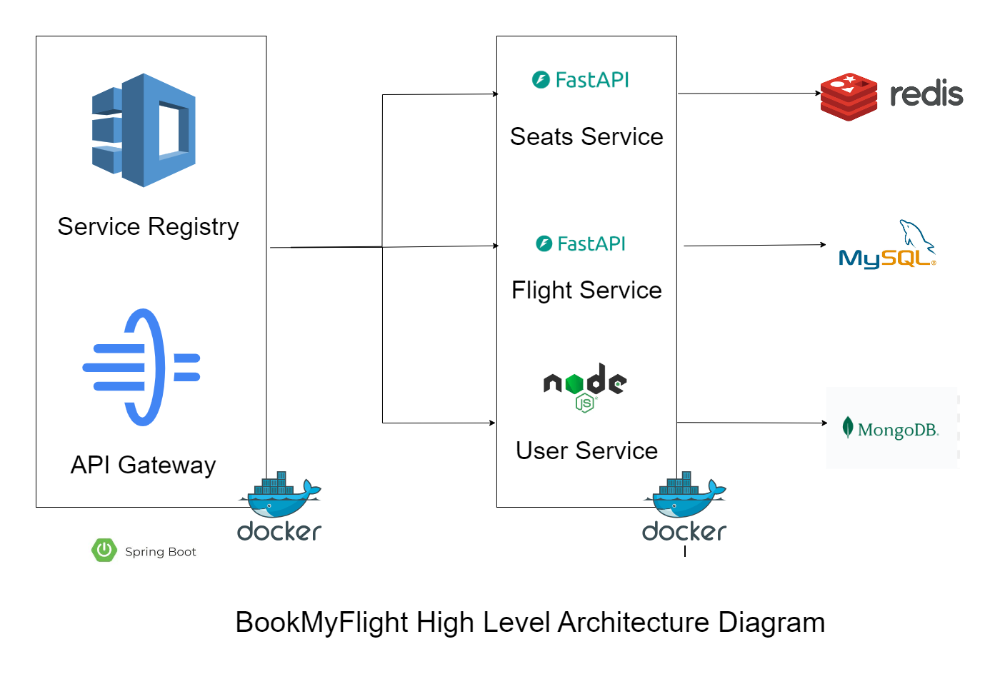

# Flight Booking Management System

A highly scalable flight booking management system built using microservices. The application uses a **single database per service** policy. The primary entities/microservices are:

---

## Microservices Overview

### 1. API Gateway
- Used **Spring Boot API Gateway** for configuring and setting up the API gateway.
- Apart from serving as a single point of contact for the end users, it also provides:
  - **User authentication**
  - **Filters incoming request URLs**
  - **Load balancing**

### 2. Service Discovery
- Used **Spring Boot's** implementation of **Netflix Eureka Discovery Server**.
- A **service registry** for storing IP and related details about various microservice instances.

### 3. Service Discovery Client
- Each microservice implements its own **discovery client** for autonomously registering itself with the **Discovery Server**.

### 4. User Service
- A **Node.js** microservice responsible for managing the registration of both admins and users.
- It also acts as an **authorization service**, issuing **JWT tokens** to respective users.
- Uses **MongoDB Atlas** for storing user and admin details.

### 5. Seats Service
- A **FastAPI** service responsible for handling real-time seat booking status.
- Uses **Redis** for storing seat details.

### 6. Flight Service
- A microservice built using **FastAPI** that handles **CRUD operations** on flights.
- Implements a small **data migration pipeline** which updates the seat data with newer data.
- Uses **distributed locking** to ensure data integrity.

---

## Learnings:

- The extensiveness of this project introduced me to the fascinating world of **microservices** and **backend development** in general.
- Learnt how **API gateways** and **service discovery servers** play a crucial role in any microservice architecture, and how services register themselves with the **service registry**.
- Worked on various web frameworks like **Spring Boot**, **FastAPI**, and **Node.js**, juggling between the flexibility provided by **FastAPI** and the relatively stricter procedures offered by **Spring Boot**.
- Gained knowledge about **distributed locks** and managing shared resources.
- Learnt how to write **Dockerfiles** along with the basics of **Docker networking**.
- Learnt how different frameworks implement their own **MVC architecture**.

---

